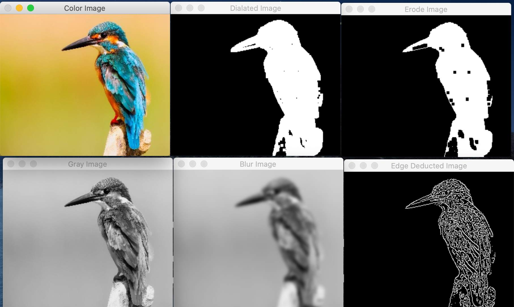
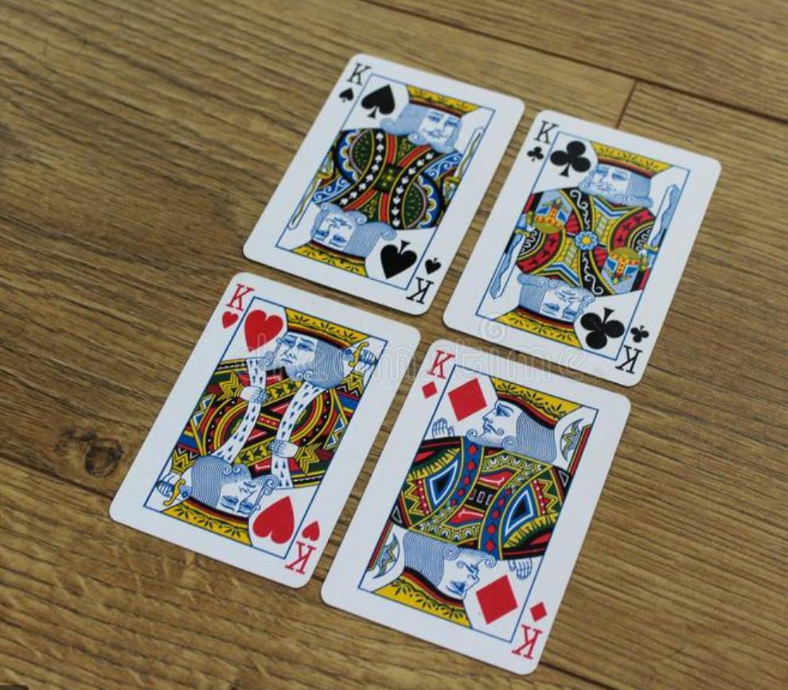
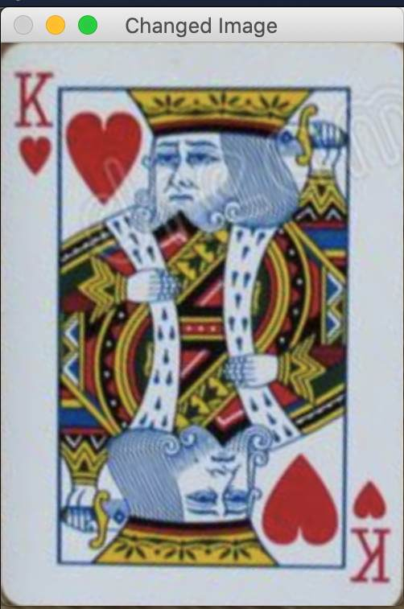
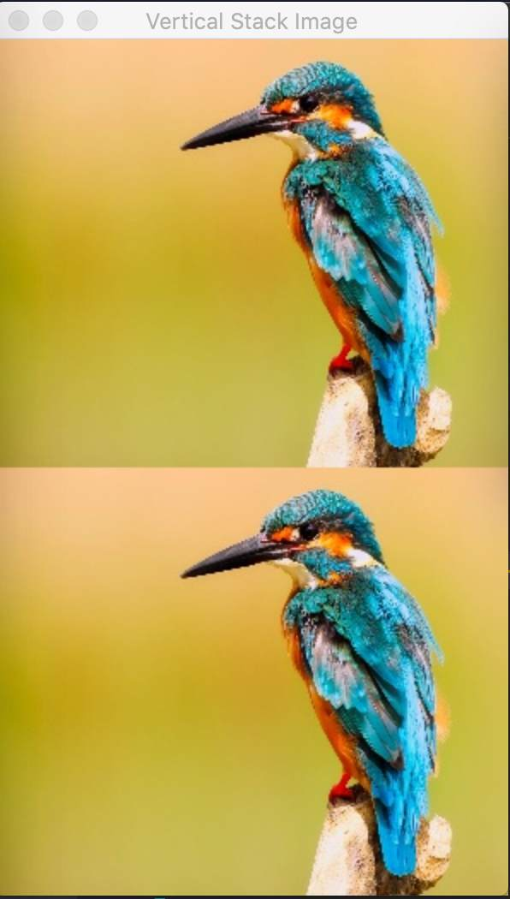
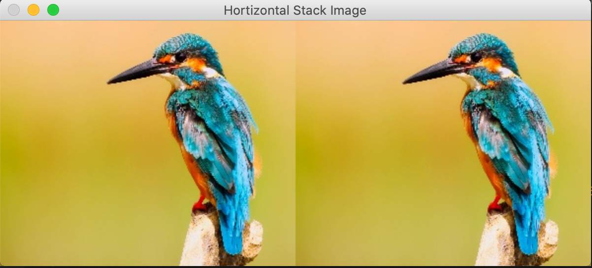

In this blog, I will be doing some more basics of OpenCV. Below are the topics we will be covering in this blog.
1. Image Functions
2. Image Wrap Perspective
3. Image Joining
4. Croping and Resizing
5. Color dedection and HSV 

## **Requirement**
As I have aready discussed in previous [blog](./2020-07-22-OpenCV-Basics.md), We need only below packages, If you dont have Anaconda install on your system. You can check [Installation](https://docs.anaconda.com/anaconda/install/) and [download](https://www.anaconda.com/products/individual) anaconda. 

```bash
conda install opencv
conda install numpy
``` 

## **Image Functions**

Image Module have many functions but I will be talking about some of them which are generally used. Let's see functions like Blur, Canny(outlining the edges), dilate and erode.

```python
import cv2
import numpy as np

# load the images
img = cv2.imread("Resources/bird.jpg",)

# Convert the image into gray scale
imgGray = cv2.cvtColor(img, cv2.COLOR_BGR2GRAY)

# Blur the images using gaussianBlur
# ksize is kernal size, should always in odd, 1 is min and x is max
imgBlur = cv2.GaussianBlur(imgGray, ksize=(15, 15), sigmaX=0)

# Deduct the edge of images, you can increase the threshold to reduce the edge deduction
imgCanny = cv2.Canny(img, threshold1=100, threshold2=100)

# Increase the thickness of edges introduce the dialation, required numpy to use matrix
imgkernal = np.ones((5, 5), np.uint8)
imgDialtion = cv2.dilate(imgCanny, kernel=imgkernal, iterations=1)

# Erode is opposide of dialtion, we decrease the thikness of Canny
imgErode = cv2.erode(imgDialtion, kernel=imgkernal, iterations=1)

# showing the images
cv2.imshow("Color Image", img)
cv2.imshow("Gray Image", imgGray)
cv2.imshow("Blur Image", imgBlur)
cv2.imshow("Edge Deducted Image", imgCanny)
cv2.imshow("Dialated Image", imgDialtion)
cv2.imshow("Erode Image", imgErode)

# show the image for 5 seconds, 0 means undefinite
cv2.waitKey(10000)

# destroy all the image windows
cv2.destroyAllWindows()
```



## **Image Wrap Perspective**

Wrap Perspective Actually helps in setting up the perspective of image, suppose you have a tilted image, which is difficult to map and compare like below. If we want run comparision or deduction it will be difficult in this case but after using wrapPerspective function it will be in required format lets see the code.

| Input                             |             Output             |
| --------------------------------- | :----------------------------: |
|  |  |

```
Syntax: cv2.warpPerspective(src, dst, dsize)

Parameters:
->src: Source Image
->dst: output image that has the size dsize and the same type as src.
->dsize: size of output image
```
```Python
import cv2
import numpy as np

img = cv2.imread('Resources/k_cards.jpg')

# set the width and height of perspective
width, height = 250, 350

# pt1 have upper left, upper right, lower left, lower right
pt1 = np.float32([[298, 339], [529, 416], [131, 650], [384, 741]])

# pt2 have the perception we want for the image
pt2 = np.float32([[0, 0], [width, 0], [0, height], [width, height]])

# get the perspective of our cordinates to actual cordinates
matrix = cv2.getPerspectiveTransform(pt1, pt2)

# wrap into output to see the Images into correct perspective
imgOutput = cv2.warpPerspective(img, matrix, (width, height))

# show image
cv2.imshow("Image", img)
cv2.imshow("Changed Image", imgOutput)

# show the image for 5 seconds, 0 means undefinite
cv2.waitKey(10000)

# destroy all the image windows
cv2.destroyAllWindows()
```
## **Image Joining**
Images joining is actually very easy when you have images of same type like RGB or only grayscale, But it will not work easily when you have different images if different channels

| img1                         |             img2              |             img2             |
| ---------------------------- | :---------------------------: | :--------------------------: |
|  |  |  |

First case will join only colored one
```python
import cv2
import numpy as np
"""
We will be joining the images into horizontal and vertical stack

Requirement:
All the images should be of same channel and format like RBG, Gray or BW

Solution:
Before stacking we can convert them into same channel stack it

"""
# reading the image
img1 = cv2.imread('Resources/img1.jpg')
img2 = cv2.imread('Resources/img2.jpg')
img3 = cv2.imread('Resources/img3.jpg')

# Horizontal stack
imgHorizontalStack = np.hstack((img1, img3))

# Vertical Stack
imgVerticalStack = np.vstack((img1, img3))

# show image
cv2.imshow("Hortizontal Stack Image", imgHorizontalStack)
cv2.imshow("Vertical Stack Image", imgVerticalStack)

# show the image for 5 seconds, 0 means undefinite
cv2.waitKey(10000)

# destroy all the image windows
cv2.destroyAllWindows()
```
| output1                       |            outpu2             |
| ----------------------------- | :---------------------------: |
|  |  |

But still there is Issue while adding the gray and color image, but I have written a simple funtion to covert it and add it, lets see the example.

```python
import cv2
import numpy as np

# function to convert the images to match the channel
def stackImages(img_list=[], stack_type=0):

    # Create the empty list to store images
    list_of_img = []
    # Iterate the images
    for img in img_list:
        # check if the image is color or not , color will have (row, column, channel) whereas gray don't have channel

        if len(img.shape) < 3:
            # transform the image to color level
            img = cv2.cvtColor(img, cv2.COLOR_GRAY2RGB)

        # add to list
        list_of_img.append(img)

    # check if we need to stack horizontal or vertical, by default is horizontal
    if stack_type == 0:
        imgStack = np.hstack(tuple(list_of_img))
    else:
        imgStack = np.vstack(tuple(list_of_img))

    # show the images
    cv2.imshow("Stacked Image", imgStack)

    # show the image for 5 seconds, 0 means undefinite
    cv2.waitKey(10000)

    # destroy all the image windows
    cv2.destroyAllWindows()

if __name__ == '__main__':
    # read the images
    img = cv2.imread('img1.jpg')
    img2 = cv2.imread('img2.jpg', 0)
    img3 = cv2.imread('img3.jpg', -1)

    # Call the function
    stackImages([img, img2, img3])
```


## **Croping and Resizing**

We Can do resizing and croping of images using below code. It required when you have big size image, which take lot of time to process. So these methods are usable to resize it.

```python
import cv2
import numpy as np

# Reading the image
img = cv2.imread("Resources/lamb.jpg")

######################  IMAGE RESIZE #################
# find the size of the images
print(img.shape)
"""
(1333, 2000, 3)  # width, height and channel
"""
# resize the image size
imgResize = cv2.resize(img, (300, 250))

# print the new image size
print(imgResize.shape)
"""
(480, 640, 3)  # width, height and channel
"""
# writing this image into new file
cv2.imwrite("Resources/lamb.jpg", imgResize)

# showing the small image
cv2.imshow("Small Size", imgResize)

######################  IMAGE CROPPING #################

ImgCropped = imgResize[0:img.shape[0], 100: img.shape[1]]  # [height, width]
cv2.imshow("Cropped Size", ImgCropped)

# waiting for the key or 10 secs
cv2.waitKey(10000)

# Destroy all the windows
cv2.destroyAllWindows()
```
I Hope you have learned something, let me know if you have any doubts and Issue.

Happy Learning !!!